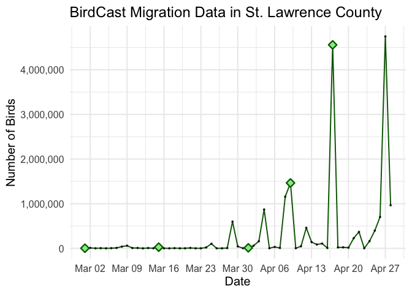
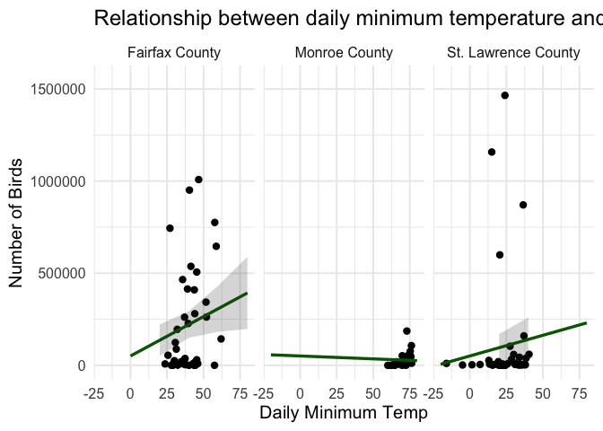

# BirdCast Migration Data for Spring 2026


### Data

BirdCast is a subset of the Cornell Lab of Ornithology. BirdCast uses
Doppler weather radar to detect the number of migrating birds during the
migration season to support bird conservation and expand knowledge of
migratory bird movement. The Doppler tracking is active from March 1 to
June 15 and August 1 to November 15; I am specifically looking at March
1, 2026 to May 1, 2026. I scraped data from BirdCast on the number of
birds per night, how fast they were flying on average, and what species
of birds are likely to be flying on a given night. I am focusing on
three different counties on the East Coast - 1 in New York, 1 in
Virginia, and 1 in Florida. I also scraped data from NOAA to compare
bird migration to weather variables.

| Variable | Description |
|----|----|
| `date` | Organized by month, day, year. |
| `birds` | Number of birds flying on a given night. |
| `flight_speed` | Average speed the birds were flying on a given night. |
| `location` | St. Lawrence County (NY), Fairfax County (VA), or Monroe County (FL). |
| `tmin` | Daily minimum temperature |
| `prcp` | Rainfall (in inches) |

### Questions

My questions of interest are: - What does nightly bird migration look
like in three different counties across the East Coast? - How do weather
variables like precipitation and temperature impact bird migration?

### Exploring Interactivity

I used plotly to make interactive graphs of nightly bird migration in
three different counties. Pictured below is my plotly of St. Lawrence
County’s (NY) nightly bird migration. SLC is a hotspot for bird
migration, with some nights having over 4 million migrants! The plotly
allows the user to explore the exact number of birds flying on a given
day as well as flight speed and likely species of birds passing through.

``` r
slc <- ggplot(data = bird_cast_slc, aes(x = date, y = birds, label = flight_speed)) +
  geom_line(color = "darkgreen") +
  geom_point(size = 0.5, alpha = 0.7) +
  geom_point(data = filter(bird_cast_slc_annotated, !is.na(note)),
    aes(text = note),
    size = 3, shape = 23, color = "darkgreen", fill = "lightgreen", stroke = 1.2) +
  scale_y_continuous(labels = scales::comma) +
  scale_x_date(date_breaks = "1 week", date_labels = "%b %d") +
  theme_minimal(base_size = 15) +
  labs(title = "BirdCast Migration Data in St. Lawrence County", y = "Number of Birds", x = "Date")
```

    Warning in geom_point(data = filter(bird_cast_slc_annotated, !is.na(note)), :
    Ignoring unknown aesthetics: text

``` r
slc
```



## Comparing Counties

This plot highlights the difference between the three different counties
on the East Coast. There are significantly more birds passing through
St. Lawrence County than Fairfax or Monroe County. The plot also shows
how much variation there is between the three counties. Fairfax County
has high variability compared to the other two counties.

``` r
ggplot(data = bird_cast_all, aes(x = date, y = birds, color = location)) +
  geom_line(linewidth = 1) +
  geom_point(size = 1.5, alpha = 0.7) +
  scale_y_continuous(labels = scales::comma) +
  scale_x_date(date_breaks = "1 week", date_labels = "%b %d") +
  theme_minimal(base_size = 15) +
  scale_color_viridis_d() +
  labs(title = "BirdCast Migration Data", y = "Number of Birds", x = "Date", color = "Location") +
  theme(legend.position = "bottom")
```


## Comparing with Weather Data

I compared the number of birds flying over each night with weather
variables like `tmin` (daily minimum temperature) and `prcp` (daily
precipitation). The plot below shows that in Fairfax and St. Lawrence
County, daily minimum temperature is positively correlated with the
number of birds. This indicates that more birds migrate when temperature
is higher. In contrast, there is very little correlation between
temperature and migratory birds in Monroe County, likely because Florida
has milder weather and less temperature variation.

``` r
ggplot(data = bird_weather, aes(x = tmin, y = birds)) +
  geom_point() +
  geom_line(data = pred, aes(x = tmin, y = predicted), color = "darkgreen", linewidth = 1.2) +
    geom_ribbon(data = pred, aes(y = predicted,
                                  ymin = conf.low,
                                  ymax = conf.high), 
              alpha = 0.2) +
  ylim(0, 1550000) +
  theme_minimal(base_size = 15) +
  facet_wrap(~location) +
  labs(title = "Relationship between daily minimum temperature and number of migratory birds", x = "Daily Minimum Temp", y = "Number of Birds")
```

    Warning: Removed 47 rows containing missing values or values outside the scale range
    (`geom_point()`).

    Warning: Removed 1 row containing missing values or values outside the scale range
    (`geom_line()`).

    Warning: Removed 12 rows containing missing values or values outside the scale range
    (`geom_ribbon()`).


